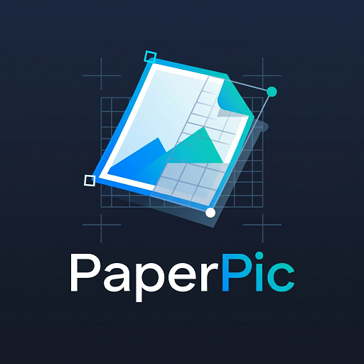
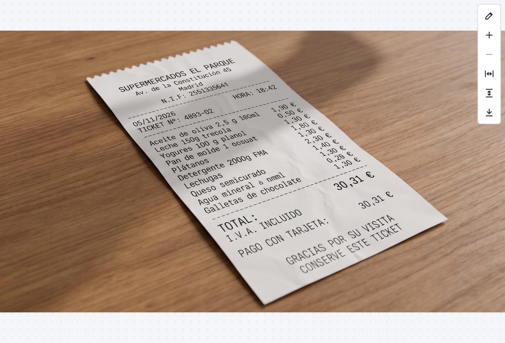

<p align="center">

<br>
Turn photos of paper into clean, readable documents, right in the browser.
</p>

<p align="center">
<a href="https://github.com/paperpic/paperpic/actions/workflows/ci.yml"></a>
<a href="./LICENSE"></a>
<a href="https://www.conventionalcommits.org/"></a>
<a href=".github/CONTRIBUTING.md"></a>
<a href=".github/CODE_OF_CONDUCT.md"></a>
<br>
<a href="https://www.typescriptlang.org/"></a>
<a href="https://vuejs.org/"></a>
<a href="https://react.dev/"></a>
<a href="https://vite.dev/"></a>
<a href="https://vitest.dev/"></a>
<a href="https://vitepress.dev/"></a>
<a href="https://nodejs.org/"></a>
<a href="https://pnpm.io/"></a>
<a href="https://www.gitkraken.com/"></a>
<br>
<a href="https://github.com/paperpic/paperpic/stargazers"></a>
</p>

> [!WARNING]
> Work in progress. Not ready for production.



## Features

- 🎪 [**Interactive docs & demos**](https://paperpic.dev)
- 🔍 **Viewer**: zoom with the buttons, the mouse wheel or a trackpad, pan, and fit to width or height
- ✂️ **Crop** with draggable corners and a magnifier for touch screens
- 📐 **Straighten** photos taken at an angle: drag four corners and get a flat page with its proportions estimated
- 🔄 **Rotate** in 90° steps, and **flip**
- ☀️ **Brightness and contrast** with live sliders
- 🧼 **Clean up** into crisp black & white, removing shadows, with an adjustable sensitivity
- ↩️ **Undo and redo** every edit until you apply, then get the result as a `Blob`
- 💾 **Download** the image on display with an optional button
- ⚡ **Off the main thread**: image processing runs in a Web Worker
- ⌨️ **Keyboard and screen readers**: shortcuts to zoom, pan, undo and apply, corner handles that move with the arrow keys, and announcements of what changes
- 🌗 **Dark mode** that follows the `color-scheme` of your page, and CSS tokens for your own theme
- 🏷️ **Custom labels and icons**: replace any text or icon in the interface
- 📦 **No runtime dependencies** in the core
- 🧩 **Framework agnostic**, with thin wrappers for Vue and React

## Quick start

```sh
pnpm add @paperpic/core
```

```ts
import { PaperPic } from '@paperpic/core'
import '@paperpic/core/style.css'

const pic = new PaperPic(document.querySelector('#viewer'), {
  src: '/receipt.jpg',
  alt: 'A receipt',
})

pic.on('apply', ({ blob }) => upload(blob))
```

The viewer fills its container, so give `#viewer` a height. With Vue or React, use [`@paperpic/vue`](packages/vue) or [`@paperpic/react`](packages/react) instead. The [docs](https://paperpic.dev/reference/options) list every option, method and event.

## Packages

| Package                             | Description                                                  | Status         |
| ----------------------------------- | ------------------------------------------------------------ | -------------- |
| [`@paperpic/core`](packages/core)   | The viewer and editor, for plain JavaScript or any framework | In development |
| [`@paperpic/vue`](packages/vue)     | Component for Vue 3.5 or newer                               | In development |
| [`@paperpic/react`](packages/react) | Component for React 19 or newer                              | In development |

## Roadmap

- A wrapper for Angular, if feasible
- More tools: free-angle straightening
- Automatic detection of the document corners

## Development

Requires Node.js 26 and pnpm 12.

```sh
pnpm install
pnpm dev         # vanilla playground with hot reload
pnpm dev:vue     # Vue playground with hot reload
pnpm dev:react   # React playground with hot reload
pnpm dev:docs    # docs site
pnpm lint
pnpm typecheck
pnpm test
pnpm build
```

The [contributing guide](.github/CONTRIBUTING.md#scripts) lists every script.

## Contributing

Contributions are welcome. Read the [contributing guide](.github/CONTRIBUTING.md) before opening a pull request, and follow the [code of conduct](.github/CODE_OF_CONDUCT.md).

Pull requests go to `development`. `main` only receives releases.

## License

[MIT](./LICENSE)
